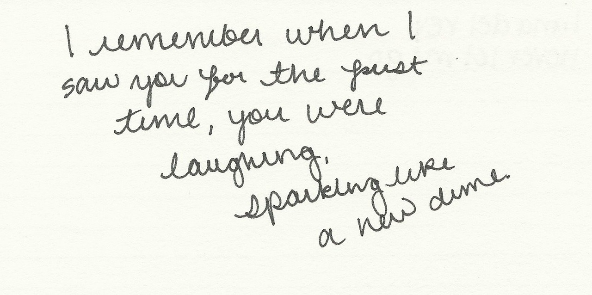

```{r setup, include=FALSE}
knitr::opts_chunk$set(echo = TRUE)
```


```{r load libraries, warning=FALSE, message=FALSE, echo=FALSE}
library(tidyverse)
library(tidytext)
library(plotly)
library(DT)
library(tm)
library(data.table)
library(scales)
library(wordcloud2)
library(gridExtra)
library(ngram)
library(shiny) 
```

We use the processed data and artist information for our analysis.

```{r load data, warning=FALSE, message=FALSE, echo=FALSE}
# load lyrics data
load('../output/processed_lyrics.RData') 
# load artist information
dt_artist <- fread('../data/artists.csv') 
```

```{r, echo=FALSE}
lyrics_list <- c("Folk", "R&B", "Electronic", "Jazz", "Indie", "Country", "Rock", "Metal", "Pop", "Hip-Hop", "Other")
time_list <- c("1970s", "1980s", "1990s", "2000s", "2010s")
corpus <- VCorpus(VectorSource(dt_lyrics$stemmedwords))
word_tibble <- tidy(corpus) %>%
  select(text) %>%
  mutate(id = row_number()) %>%
  unnest_tokens(word, text)
```


```{r, echo=FALSE}
# Define UI for app that draws a histogram ----
ui <- navbarPage(strong("Lyrics Analysis"),
  tabPanel("Overview",
    titlePanel("Most frequent words"),
    # Sidebar layout with input and output definitions ----
    sidebarLayout(
      # Sidebar panel for inputs ----
      sidebarPanel(
        sliderInput(inputId = "nwords1",
                    label = "Number of terms in the first word cloud:",
                    min = 5, max = 100, value = 50),
        selectInput('genre1', 'Genre of the first word cloud', 
                    lyrics_list, selected='Folk')

    ),
    # Main panel for displaying outputs ----
    mainPanel(
      wordcloud2Output(outputId = "WC1", height = "300")
    )
  ),
  hr(),
  sidebarLayout(
      # Sidebar panel for inputs ----
      sidebarPanel(
        sliderInput(inputId = "nwords2",
                    label = "Number of terms in the second word cloud:",
                    min = 5, max = 100, value = 50),
        selectInput('genre2', 'Genre of the second word cloud', 
                    lyrics_list, selected='Metal')
    ),
    # Main panel for displaying outputs ----
    mainPanel(
      wordcloud2Output(outputId = "WC2", height = "300")
    )
  )
           ),
  tabPanel("Time Variation",
           # Sidebar layout with input and output definitions ----
          sidebarLayout(
            # Sidebar panel for inputs ----
            sidebarPanel(
              selectInput('decade1', 'Selected decade for the first plot:', 
                          time_list, selected='1970s'),
              selectInput('decade2', 'Selected decade for the second plot:', 
                          time_list, selected='1980s'),
              numericInput(inputId = "topBigrams",
                                          label = "Number of top pairs to view:",
                                          min = 1,
                                          max = 20,
                                          value = 10)
      
          ),
          # Main panel for displaying outputs ----
          mainPanel(
            fluidRow(
              column(5,
                     plotlyOutput("bigram1")),
              column(5,
                     plotlyOutput("bigram2"))
            )
          )
        )
           ),
  tabPanel("Data", 
           DT::dataTableOutput("table"))
)
```

```{r, echo=FALSE}
server <- function(input, output) {
  output$WC1 <- renderWordcloud2({
    count(filter(word_tibble, id %in% which(dt_lyrics$genre == input$genre1)), word, sort = TRUE) %>%
      slice(1:input$nwords1) %>%
      wordcloud2(size=0.6, rotateRatio=0.2)
  })
  output$WC2 <- renderWordcloud2({
    count(filter(word_tibble, id %in% which(dt_lyrics$genre == input$genre2)), word, sort = TRUE) %>%
      slice(1:input$nwords2) %>%
      wordcloud2(size=0.6, rotateRatio=0.2)
  })
  output$bigram1 <- renderPlotly({
    year_start <- as.integer(substr(input$decade1, 1, 4))
    dt_sub <- filter(dt_lyrics, year>=year_start) %>%
      filter(year<(year_start+10))
    lyric_bigrams <- dt_sub %>%
      unnest_tokens(bigram, stemmedwords, token = "ngrams", n = 2)
    bigram_counts <- lyric_bigrams %>%
      separate(bigram, c("word1", "word2"), sep = " ") %>%
      count(word1, word2, sort = TRUE)
    combined_words <- apply(bigram_counts[c(1, 2)], 1, paste , collapse = " " )[1:input$topBigrams]
    x_names <- factor(combined_words, levels = rev(combined_words))
    plot_ly(
      x = bigram_counts$n[1:input$topBigrams],
      y = x_names,
      name = "Bigram",
      type = "bar",
      orientation = 'h'
    )
  })
  output$bigram2 <- renderPlotly({
    year_start <- as.integer(substr(input$decade2, 1, 4))
    dt_sub <- filter(dt_lyrics, year>=year_start) %>%
      filter(year<(year_start+10))
    lyric_bigrams <- dt_sub %>%
      unnest_tokens(bigram, stemmedwords, token = "ngrams", n = 2)
    bigram_counts <- lyric_bigrams %>%
      separate(bigram, c("word1", "word2"), sep = " ") %>%
      count(word1, word2, sort = TRUE)
    combined_words <- apply(bigram_counts[c(1, 2)], 1, paste , collapse = " " )[1:input$topBigrams]
    x_names <- factor(combined_words, levels = rev(combined_words))
    plot_ly(
      x = bigram_counts$n[1:input$topBigrams],
      y = x_names,
      name = "Bigram",
      type = "bar",
      orientation = 'h'
    )
  })
  output$table <- DT::renderDataTable({
    DT::datatable(dt_lyrics)
  })
}
```


## Question 1: What is a song: a lyric view
To many listeners there are just two parts to a song: the music and the lyrics. Good melody is not enough to make a song marvelous, thus crafting the Words is a must to bring a song to life. So how many words are there to make a song? What's the most frequent word in different genres? Let's dive into this.

```{r, echo=FALSE}
dt_lyrics['wordcounts'] <- summarise(group_by(word_tibble,id),n())[,2]
summary(dt_lyrics$wordcounts)
head(dt_lyrics[dt_lyrics$wordcounts<=5,],3)
head(dt_lyrics[dt_lyrics$wordcounts>=200,],3)
ggplot(data.frame(word_num = dt_lyrics$wordcounts)) + 
  geom_boxplot(aes(y=word_num)) + 
  guides(fill=FALSE) + 
  coord_flip()

# genre_wcount <- summarise(group_by(dt_lyrics,genre),mean(wordcounts))
# colnames(genre_wcount) <- c('genre','mean')
# ggplot((genre_wcount)) +
#   geom_bar(aes(x=genre, y=mean),stat = 'identity')

tmp <- data.frame(genre=dt_lyrics$genre,wordcounts=dt_lyrics$wordcounts)
ggplot(tmp[tmp$wordcounts<1500,]) +
  geom_boxplot(aes(x=genre,y=wordcounts,fill=genre))

year_wcount <- summarise(group_by(dt_lyrics,year),mean(wordcounts))
colnames(year_wcount) <- c('year','mean')
ggplot((year_wcount[year_wcount$year>1900,]),aes(x=year, y=mean)) +
  geom_point() +
  geom_smooth(method='lm')

```


In terms of stemmed words, most songs contain less than 100 words, with mean 75.71 and median 61. However some lyrics can reach as many as 2440 words, so the data is highly right skewed.   
If we check the word counts by genre, it's obvious that Hip-Hop has the most word counts on average: it almost reach 200 words.   
It's insteresting that the word counts seem to increase with year. Perhaps it's because in past days, people used to listen to songs on the radio, and a long song might distract people's attention. By the way Queen's Bohemian Rhapsody is too long for radio but it is a huge hit!


```{r shiny app, warning=FALSE, message=FALSE, echo=FALSE}
shinyApp(ui, server)
```

```{r, warning=FALSE, echo=FALSE}
word_tibble$love <- word_tibble$word=='love'
love_count <- summarise(group_by(left_join(dt_lyrics, tally(group_by(word_tibble,id),sum(love)), by = c('id'), copy = F),year,genre),sum(n))
colnames(love_count) <- c('year','genre','count')
ggplot((love_count[love_count$year>1900&love_count$count<10000&love_count$genre!='Not Available'&love_count$genre!='Other',])) +
  geom_line(aes(x=year, y=count,col=genre))

```

(shiny app is not support in static file, please knit the .rmd file for a better view)  
As for the most frequent word along time, love dominates all types of genres, especially Pop music and Rock music.

## Question 2: What is a song: an artist view
Lyrics themselves cannot make a song, without singers to do the arrangements, they are no more than poems. My favorite singer is Lana Del Rey, she writes songs and she arranges them. Her music is individual and her voice is distinctive.(Please check 'Never let me go', her best song in my opinion). She is also a very productive singer. So generally, how productive are all the artists in our dataset? Do they stick to one genre?


```{r, warning=FALSE, echo=FALSE}
artist_n <- tally(group_by(dt_lyrics,artist),n())
summary(artist_n$n)
n_song <- tally(group_by(artist_n,n),n())
colnames(n_song) <- c('num_of_songs','n')
ggplot(n_song) +
  geom_line(aes(x=num_of_songs, y=n))

```

Writing songs is not easy, the average number of songs is about 50 while the median is 28, thus the data is highly right skewed. Some artists are so productive that they writes over 400 songs.  

```{r, warning=FALSE, echo=FALSE}
artist <- distinct(dt_lyrics,artist)
for(i in c('Country','Electronic','Folk','Hip-Hop','Indie','Jazz','Metal','Pop','R&B','Rock')){
  artist <- cbind(artist,ifelse((tally(group_by(dt_lyrics,artist),genre==i)>0)[,2],1,0))
}
colnames(artist) <- c('artist','Country','Electronic','Folk','Hip-Hop','Indie','Jazz','Metal','Pop','R&B','Rock')
artist$n_genre <- rowSums(artist[,-1])
print('Percentage of artists sticking to one genre:')
print(sum(artist$n_genre==1)/sum(artist$n_genre>0))
```

 And data shows in fact all the artist stick to one genre.
 

## Conclusion
1.Most songs contain less than 100 stemmed words; Hip-Hop has the most word counts on average; word counts seem to increase with year.  
2.The most frequent word is 'love', especially in Pop and Rock genre.    
3.The number of songs written by one artist is highly right skewed with mean 50 and median 28. And most artists stick to one genre.